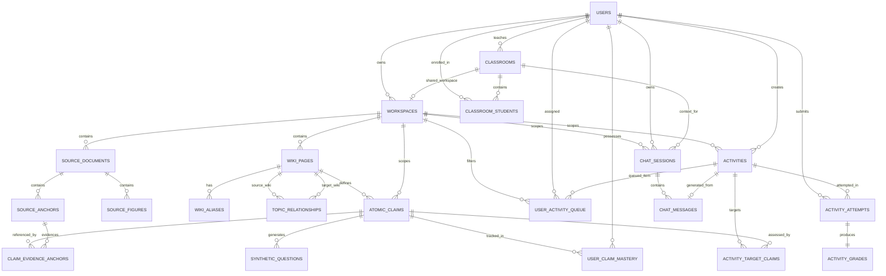

# Relational Database Structure & CRUD Operations Specification

> Archived reference. This document may contradict the active specification. Use the [active docs](../../index.md) for current requirements.

**Project:** Autonomous Pedagogical Knowledge Graph System (APKGS) / Education Platform  
**Document Status:** Conceptual & Language-Agnostic Specification  
**Scope:** Defines logical data entities, attributes, relationships, indexing guidelines, and high-level CRUD operational logic independent of any specific RDBMS dialect, SQL syntax, or ORM framework.

---

## 1. Overview & Architectural Principles

The relational database setup underpins the dual-layer system design:
1. **Layer 1: Immutable Ground-Truth Evidence (Write-Once, Read-Many):** Stores uploaded textbooks, video/audio transcripts, visual locators, and figures without in-place modification.
2. **Layer 2: Mutable Pedagogical Knowledge Graph:** Tracks synthesized evergreen topic wiki pages, atomic claims, and DAG (Directed Acyclic Graph) topic relationships.
3. **Student Mastery & Gamification Engine:** Manages activity attempts, rubrics, evaluation outcomes (`demonstrated`, `missing`, `contradicted`, `uncertain`), mastery states, XP, and classroom diagnostic progress.
4. **Chat & Interactive Session Logs:** Logs real-time conversational history, vector retrieval references, and MCP tool executions.

---

## 2. Entity-Relationship Architecture (ERD)

---

## 3. Entity & Structure Definitions

### 3.1 `User`
Stores system accounts for students, teachers, and administrators.

| Field Name | Type | Constraints | Description |
|---|---|---|---|
| `id` | Identifier | Primary Key, Unique, Auto-increment | Unique user identifier |
| `name` | String | Required | Full user display name |
| `email` | String | Unique, Required | User email address |
| `password_hash` | String | Required | Secure hashed authentication key |
| `role` | Enum | Required (`STUDENT`, `TEACHER`, `INDIVIDUAL_LEARNER`, `ADMIN`) | System authorization role |

| `xp_total` | Integer | Required, Default: `0`, Min: `0` | Cumulative gamification experience points |
| `level` | Integer | Required, Default: `1`, Min: `1` | Current user level derived from total XP |
| `created_at` | Timestamp | Required, Default: Current Time | Account creation timestamp |
| `updated_at` | Timestamp | Required, Default: Current Time | Last profile update timestamp |

---

### 3.2 `Classroom` & `ClassroomStudent`
Represents teacher-managed learning spaces and student enrollment rosters.

#### **Entity: `Classroom`**
| Field Name | Type | Constraints | Description |
|---|---|---|---|
| `id` | Identifier | Primary Key, Unique | Unique classroom identifier |
| `title` | String | Required | Classroom name/title |
| `description` | Text | Optional | Course overview and details |
| `teacher_id` | Identifier | Foreign Key -> `User.id`, Required | Managing teacher user ID |
| `join_code` | String | Unique, Required | Code used by students to enroll |
| `created_at` | Timestamp | Required | Creation timestamp |
| `updated_at` | Timestamp | Required | Last modification timestamp |

#### **Entity: `ClassroomStudent` (Junction)**
| Field Name | Type | Constraints | Description |
|---|---|---|---|
| `classroom_id` | Identifier | Primary Key, Foreign Key -> `Classroom.id` | Associated classroom |
| `student_id` | Identifier | Primary Key, Foreign Key -> `User.id` | Enrolled student |
| `enrolled_at` | Timestamp | Required | Student join timestamp |

#### **Entity: `Workspace` (Notebook / Learning Vault)**
| Field Name | Type | Constraints | Description |
|---|---|---|---|
| `id` | Identifier | Primary Key, Unique | Unique workspace identifier |
| `user_id` | Identifier | Foreign Key -> `User.id`, Required | Creator/Owner user ID |
| `classroom_id` | Identifier | Foreign Key -> `Classroom.id`, Optional | Associated classroom if shared |
| `title` | String | Required | Workspace / Notebook title (e.g., 'Quantum Computing') |
| `description` | Text | Optional | Workspace summary and scope |
| `is_classroom_shared` | Boolean | Required, Default: `false` | True if this workspace is a shared classroom workspace |
| `created_at` | Timestamp | Required | Creation timestamp |
| `updated_at` | Timestamp | Required | Last modification timestamp |

---

### 3.3 Layer 1: Immutable Source Library (`SourceDocument`, `SourceAnchor`, `SourceFigure`)
Immutable ground-truth evidence storage (textbooks, video/audio transcripts, locators, visual assets).

#### **Entity: `SourceDocument`**
| Field Name | Type | Constraints | Description |
|---|---|---|---|
| `id` | Identifier | Primary Key, Unique | Unique source document identifier |
| `workspace_id` | Identifier | Foreign Key -> `Workspace.id`, Required | Scoping workspace / notebook ID |
| `user_id` | Identifier | Foreign Key -> `User.id`, Required | Uploader user ID |

| `title` | String | Required | Document or media title |
| `storage_uri` | String | Required | Remote storage location reference |
| `source_type` | Enum | Required (`PDF`, `PODCAST`, `TRANSCRIPT`, `WEB`, `MARKDOWN`) | Media type format |
| `raw_markdown` | Text | Required | Normalized full-text markdown string |
| `ingested_at` | Timestamp | Required | Ingestion completion timestamp |
| `metadata_json` | Object / JSON | Optional | Structural metadata (authors, edition, dates) |

#### **Entity: `SourceAnchor`**
| Field Name | Type | Constraints | Description |
|---|---|---|---|
| `id` | Identifier | Primary Key, Unique | Unique anchor identifier |
| `source_document_id` | Identifier | Foreign Key -> `SourceDocument.id`, Required | Parent document reference |
| `chapter` | String | Optional | Book chapter or section header |
| `page_number` | Integer | Optional | Document page number |
| `timestamp_start` | String | Optional | Media start timestamp |
| `timestamp_end` | String | Optional | Media end timestamp |
| `locator_text` | Text | Required | Quoted ground-truth evidence passage |
| `created_at` | Timestamp | Required | Creation timestamp |

#### **Entity: `SourceFigure`**
| Field Name | Type | Constraints | Description |
|---|---|---|---|
| `id` | Identifier | Primary Key, Unique | Unique figure identifier |
| `source_document_id` | Identifier | Foreign Key -> `SourceDocument.id`, Required | Parent document reference |
| `chapter` | String | Optional | Chapter or slide deck reference |
| `page_number` | Integer | Optional | Page number |
| `timestamp_mark` | String | Optional | Media frame timestamp |
| `asset_url` | String | Required | Remote asset location |
| `description` | Text | Required | Semantic description of the visual asset |
| `pedagogical_role` | String | Optional | Function in learning context |

---

### 3.4 Layer 2: Mutable Knowledge Graph (`WikiPage`, `WikiAlias`, `TopicRelationship`)
Evergreen, synthesized learning topics and graph topologies.

#### **Entity: `WikiPage`**
| Field Name | Type | Constraints | Description |
|---|---|---|---|
| `id` | Identifier | Primary Key, Unique | Unique wiki page identifier |
| `workspace_id` | Identifier | Foreign Key -> `Workspace.id`, Required | Scoping workspace / notebook ID |
| `user_id` | Identifier | Foreign Key -> `User.id`, Required | Creator user ID |

| `topic_key` | String | Unique, Required | Human-readable slug (e.g., `topic_gaussian_elimination`) |
| `title` | String | Required | Display topic title |
| `overview` | Text | Required | High-level conceptual summary |
| `status` | Enum | Required (`draft`, `verified`, `disputed`, `hollow_archived`) | Editorial verification state |
| `version` | Decimal | Required, Default: `1.0` | Content revision version |
| `created_at` | Timestamp | Required | Creation timestamp |
| `updated_at` | Timestamp | Required | Last modification timestamp |

#### **Entity: `WikiAlias`**
| Field Name | Type | Constraints | Description |
|---|---|---|---|
| `id` | Identifier | Primary Key, Unique | Unique alias identifier |
| `wiki_page_id` | Identifier | Foreign Key -> `WikiPage.id`, Required | Associated wiki topic |
| `alias` | String | Required | Alternative search term/synonym |

#### **Entity: `TopicRelationship`**
| Field Name | Type | Constraints | Description |
|---|---|---|---|
| `id` | Identifier | Primary Key, Unique | Unique edge identifier |
| `source_wiki_id` | Identifier | Foreign Key -> `WikiPage.id`, Required | Origin topic in relationship |
| `target_wiki_id` | Identifier | Foreign Key -> `WikiPage.id`, Required | Destination topic |
| `relationship_type` | Enum | Required (`prerequisite`, `dependent`, `related`, `conceptual_analogy`) | Relationship classification |
| `is_dag_prerequisite` | Boolean | Required, Default: `false` | Flag enforcing strict DAG dependency rules |

---

### 3.5 Atomic Claims & Synthetic Queries (`AtomicClaim`, `ClaimEvidenceAnchor`, `SyntheticQuestion`)
Fine-grained testable knowledge units and question generation targets.

#### **Entity: `AtomicClaim`**
| Field Name | Type | Constraints | Description |
|---|---|---|---|
| `id` | Identifier | Primary Key, Unique | Unique claim identifier |
| `workspace_id` | Identifier | Foreign Key -> `Workspace.id`, Required | Scoping workspace / notebook ID |
| `wiki_page_id` | Identifier | Foreign Key -> `WikiPage.id`, Required | Parent topic page |

| `claim_code` | String | Required (Unique per wiki page) | Stable claim ID (e.g., `claim_ge_01`) |
| `title` | String | Required | Descriptive claim name |
| `content` | Text | Required | Exact atomic statement |
| `assessment_target` | Text | Required | Rubric objective evaluated during activities |

#### **Entity: `ClaimEvidenceAnchor` (Junction)**
| Field Name | Type | Constraints | Description |
|---|---|---|---|
| `claim_id` | Identifier | Primary Key, Foreign Key -> `AtomicClaim.id` | Target atomic claim |
| `anchor_id` | Identifier | Primary Key, Foreign Key -> `SourceAnchor.id` | Backing evidence locator |

#### **Entity: `SyntheticQuestion`**
| Field Name | Type | Constraints | Description |
|---|---|---|---|
| `id` | Identifier | Primary Key, Unique | Unique synthetic question identifier |
| `claim_id` | Identifier | Foreign Key -> `AtomicClaim.id`, Required | Target claim assessed |
| `question_text` | Text | Required | Generated prompt text for RAG alignment |

---

### 3.6 Multi-Vector Retrieval Index (`VectorIndexEntry`)
Multi-granularity vector storage for semantic retrieval.

| Field Name | Type | Constraints | Description |
|---|---|---|---|
| `id` | Identifier | Primary Key, Unique | Unique vector index record identifier |
| `target_type` | Enum | Required (`page_summary`, `claim`, `synthetic_query`) | Retrieval granularity layer |
| `wiki_page_id` | Identifier | Foreign Key -> `WikiPage.id`, Optional | Associated wiki page (for summaries) |
| `claim_id` | Identifier | Foreign Key -> `AtomicClaim.id`, Optional | Associated claim (for direct claims) |
| `synthetic_question_id` | Identifier | Foreign Key -> `SyntheticQuestion.id`, Optional | Associated synthetic question |
| `embedding` | Vector Float Array | Required (e.g., 1536 dimensions) | Numerical vector embedding |
| `metadata_json` | Object / JSON | Optional | Additional search metadata |

---

### 3.7 Student Mastery & Progress (`UserClaimMastery`)
Tracks student performance per atomic claim.

| Field Name | Type | Constraints | Description |
|---|---|---|---|
| `id` | Identifier | Primary Key, Unique | Unique mastery record identifier |
| `user_id` | Identifier | Foreign Key -> `User.id`, Required | Student user ID |
| `claim_id` | Identifier | Foreign Key -> `AtomicClaim.id`, Required | Assessed claim |
| `understanding_rating` | Integer | Required, Default: `1`, Range: `1` to `5` | Self/System rating scale |
| `mastery_status` | Enum | Required (`demonstrated`, `missing`, `contradicted`, `uncertain`) | System assessment judgment |
| `last_assessed_at` | Timestamp | Required | Timestamp of last evaluation |

---

### 3.8 Pedagogical Activities & Execution Engine (`Activity`, `ActivityAttempt`, `ActivityGrade`)
Activity specifications, student queues, attempts, and rubrics.

#### **Entity: `Activity`**
| Field Name | Type | Constraints | Description |
|---|---|---|---|
| `id` | Identifier | Primary Key, Unique | Unique activity identifier |
| `workspace_id` | Identifier | Foreign Key -> `Workspace.id`, Required | Scoping workspace / notebook ID |
| `created_by_user_id` | Identifier | Foreign Key -> `User.id`, Required | Creator (Teacher or Student) user ID |
| `scope` | Enum | Required (`CLASSROOM_SHARED`, `STUDENT_PERSONAL`) | Visibility scope (Broad to classroom vs Personal to student) |
| `title` | String | Required | Activity title |
| `activity_type` | Enum | Required (`flashcard`, `quiz_multichoice`, `quiz_truefalse`, `quiz_shortanswer`, `wrong_on_purpose`, `feynman_diagnostic`, `scenario`, `micro_project`, `audio_overview`) | Format category |
| `difficulty` | Integer | Required, Default: `1`, Range: `1` to `3` | Complexity level |
| `friction_levers_json` | Object / JSON | Optional | Noise, representation, and scaffolding settings |
| `scaffold_hints_json` | Array / JSON | Optional | Progressive hints array |
| `solution_rubric_json` | Object / JSON | Required | Evaluation rubric and answer key |
| `xp_reward` | Integer | Required, Default: `10` | Experience point reward |

#### **Entity: `UserActivityQueue`**
| Field Name | Type | Constraints | Description |
|---|---|---|---|
| `id` | Identifier | Primary Key, Unique | Queue item identifier |
| `user_id` | Identifier | Foreign Key -> `User.id`, Required | Target student |
| `activity_id` | Identifier | Foreign Key -> `Activity.id`, Required | Assigned activity |
| `status` | Enum | Required (`queued`, `in_progress`, `completed`) | Queue progress state |
| `assigned_by_teacher_id` | Identifier | Foreign Key -> `User.id`, Optional | Assigning teacher |
| `assigned_classroom_id` | Identifier | Foreign Key -> `Classroom.id`, Optional | Associated classroom context |

#### **Entity: `ActivityAttempt`**
| Field Name | Type | Constraints | Description |
|---|---|---|---|
| `id` | Identifier | Primary Key, Unique | Attempt record identifier |
| `user_id` | Identifier | Foreign Key -> `User.id`, Required | Student user ID |
| `activity_id` | Identifier | Foreign Key -> `Activity.id`, Required | Attempted activity |
| `submitted_payload_json` | Object / JSON | Required | Raw student answer submission |
| `assistance_used_json` | Object / JSON | Optional | Hints requested / tools used during attempt |
| `attempted_at` | Timestamp | Required | Submission timestamp |

#### **Entity: `ActivityGrade`**
| Field Name | Type | Constraints | Description |
|---|---|---|---|
| `id` | Identifier | Primary Key, Unique | Evaluation record identifier |
| `attempt_id` | Identifier | Unique, Foreign Key -> `ActivityAttempt.id` | Evaluated attempt |
| `overall_result` | Enum | Required (`demonstrated`, `missing`, `contradicted`, `uncertain`) | Global assessment outcome |
| `claim_results_json` | Object / JSON | Required | Per-claim breakdown of outcomes |
| `explanatory_feedback` | Text | Required | Diagnostic feedback for student |
| `xp_awarded` | Integer | Required, Default: `0` | Points added to user profile |

---

### 3.9 Interactive Chat & Log Systems (`ChatSession`, `ChatMessage`)
Chat sessions, message history, and contextual references.

#### **Entity: `ChatSession`**
| Field Name | Type | Constraints | Description |
|---|---|---|---|
| `id` | Identifier | Primary Key, Unique | Conversation session ID |
| `workspace_id` | Identifier | Foreign Key -> `Workspace.id`, Required | Scoping workspace / notebook ID |
| `user_id` | Identifier | Foreign Key -> `User.id`, Required | Session owner |
| `classroom_id` | Identifier | Foreign Key -> `Classroom.id`, Optional | Active classroom context |
| `title` | String | Required, Default: `'New Conversation'` | Conversation header |

#### **Entity: `ChatMessage`**
| Field Name | Type | Constraints | Description |
|---|---|---|---|
| `id` | Identifier | Primary Key, Unique | Message record ID |
| `session_id` | Identifier | Foreign Key -> `ChatSession.id`, Required | Parent conversation session |
| `sender` | Enum | Required (`USER`, `AI`) | Message originator |
| `message_text` | Text | Required | Message text content |
| `referenced_wiki_ids_json` | Array / JSON | Optional | List of retrieved wiki IDs used in answer |
| `referenced_claim_ids_json` | Array / JSON | Optional | List of retrieved atomic claim IDs |
| `mcp_tool_calls_json` | Array / JSON | Optional | Executed tool call payloads |
| `generated_activity_id` | Identifier | Foreign Key -> `Activity.id`, Optional | Generated activity link |

---

## 4. Conceptual CRUD Specifications

High-level operational specifications detailing inputs, logical validation steps, and system outcomes.

### 4.1 User & Classroom Management

#### **Operation: Create User**
* **Inputs:** `name`, `email`, `password_hash`, `role`
* **Pre-conditions:** `email` must be unique across all existing accounts.
* **Process:**
  1. Validate email format and role type (`STUDENT`, `TEACHER`, `ADMIN`).
  2. Insert new record with initial `xp_total = 0` and `level = 1`.
* **Output:** User object excluding sensitive credentials.

#### **Operation: Create Classroom (Teacher)**
* **Inputs:** `teacher_id`, `title`, `description`
* **Process:**
  1. Validate that `teacher_id` belongs to a user with `role = TEACHER`.
  2. Generate a unique 6-character alphanumeric `join_code` (e.g. `'QK7B9X'`).
  3. Create and return the new `Classroom` record with `join_code`.

#### **Operation: Enroll Student via Join Code**
* **Inputs:** `student_id`, `join_code`
* **Process:**
  1. Look up `Classroom` matching `join_code`. If not found, throw invalid join code error.
  2. Check if a `ClassroomStudent` record already exists for (`classroom_id`, `student_id`). If enrolled, return existing enrollment state.
  3. Insert new `ClassroomStudent` record (`classroom_id`, `student_id`, `enrolled_at = CURRENT_TIMESTAMP`).
  4. Automatically queue active classroom-assigned activities (`CLASSROOM_SHARED`) for the newly joined student.
* **Output:** Success status and joined `Classroom` details.

#### **Operation: Get Classroom Diagnostic Matrix**
* **Inputs:** `classroom_id`
* **Process:**
  1. Retrieve all enrolled students associated with `classroom_id`.
  2. Fetch all atomic claims associated with active course wiki pages.
  3. Perform a cross-join lookup between students and claims against `UserClaimMastery`.
  4. Return a grid matrix mapping student IDs to claim statuses (`demonstrated`, `missing`, `contradicted`, `uncertain`).

---

### 4.2 Layer 1 Ingestion & Provenance Operations

#### **Operation: Ingest Source Document**
* **Inputs:** `user_id`, `title`, `storage_uri`, `source_type`, `raw_markdown`, list of `anchors`, list of `figures`
* **Process:**
  1. Create a `SourceDocument` record in the immutable layer.
  2. Iterate through extracted passages and bulk-create `SourceAnchor` entries.
  3. Iterate through visual assets and create `SourceFigure` entries.
* **Output:** Created document ID and anchor registry list.

#### **Operation: Cascading Source Deletion**
* **Inputs:** `source_document_id`
* **Process:**
  1. Identify all `SourceAnchor` records belonging to the source document.
  2. Locate all `AtomicClaim` records referenced *only* by these anchors.
  3. Delete single-sourced `AtomicClaim` records.
  4. Inspect target `WikiPage` records; if a wiki page has 0 remaining active claims, update its status to `hollow_archived`.
  5. Delete the parent `SourceDocument` record (cascading deletion of associated anchors and figures).

---

### 4.3 Layer 2 Knowledge Graph Operations

#### **Operation: Upsert Wiki Page & Atomic Claims**
* **Inputs:** `topic_key`, `title`, `overview`, `status`, list of `claims`
* **Process:**
  1. Check if `topic_key` exists.
     - If existing: Update title, overview, status, and increment `version` number.
     - If new: Create `WikiPage` record.
  2. For each claim in payload:
     - Match on (`wiki_page_id`, `claim_code`). Upsert claim title, statement content, and rubric assessment target.

#### **Operation: Add Prerequisite Link with Cycle Detection**
* **Inputs:** `source_wiki_id`, `target_wiki_id`, `relationship_type`
* **Pre-conditions:** `source_wiki_id` and `target_wiki_id` must not be identical.
* **Process:**
  1. If `relationship_type` is `prerequisite` or `is_dag_prerequisite` is set to `true`:
     - Perform a graph traversal (e.g. Depth-First Search / Breadth-First Search) starting from `target_wiki_id` following active prerequisite edges.
     - If `source_wiki_id` is encountered during traversal, abort transaction and reject creation due to DAG cycle violation.
  2. Insert the edge record into `TopicRelationship`.

---

### 4.4 RAG Multi-Vector Search & Retrieval

#### **Operation: Multi-Granularity Similarity Search**
* **Inputs:** `query_vector`, `similarity_threshold`, `top_k_limit`
* **Process:**
  1. Compare `query_vector` against all records in `VectorIndexEntry` using cosine distance.
  2. Filter entries meeting or exceeding `similarity_threshold`.
  3. Route findings based on `target_type`:
     - If hit is `claim`: Resolve claim details, rubric target, and parent `WikiPage`.
     - If hit is `synthetic_query`: Resolve target claim and rubric.
     - If hit is `page_summary`: Retrieve parent topic overview.
  4. Return ranked candidate set ordered by highest similarity.

---

### 4.5 Activity Attempt & Gamification Execution Loop

#### **Operation: Submit & Grade Activity Attempt**
* **Inputs:** `user_id`, `activity_id`, `submitted_payload`, `claim_evaluations` (list of claim outcomes and feedback)
* **Process:**
  1. Record `ActivityAttempt` entry with raw submission payload and timestamp.
  2. Record `ActivityGrade` entry with global outcome (`demonstrated`, `missing`, `contradicted`, `uncertain`), claim breakdown, and calculated XP reward.
  3. Update `UserActivityQueue` status to `completed`.
  4. Add awarded XP to student's `User.xp_total` and calculate new `User.level`.
  5. Upsert `UserClaimMastery` record for each targeted claim with the latest mastery status and evaluation timestamp.

---

## 5. Integrity Rules & Lifecycle Strategies

1. **Immutability Enforcement:**
   - Layer 1 tables (`SourceDocument`, `SourceAnchor`, `SourceFigure`) are write-once. Updates to source media must be ingested as distinct new entities.
2. **Append-Only Diagnostic Audit:**
   - Student attempt records (`ActivityAttempt`) and evaluation outputs (`ActivityGrade`) are preserved indefinitely for learning analytics.
3. **Graph Topology Rules:**
   - Ordinary topic links (`related`, `conceptual_analogy`) may form cycles.
   - Links flagged with `is_dag_prerequisite = true` must strictly enforce a Directed Acyclic Graph topology.
